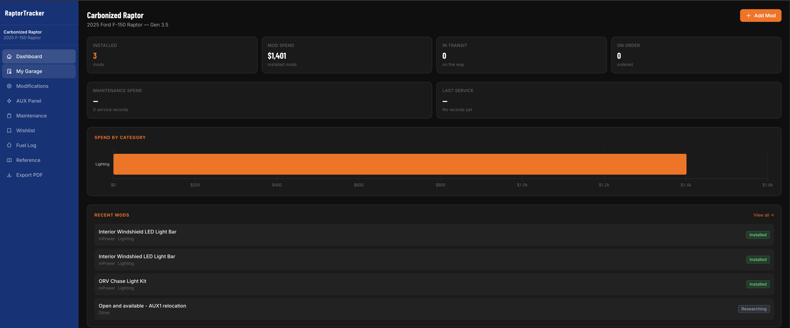
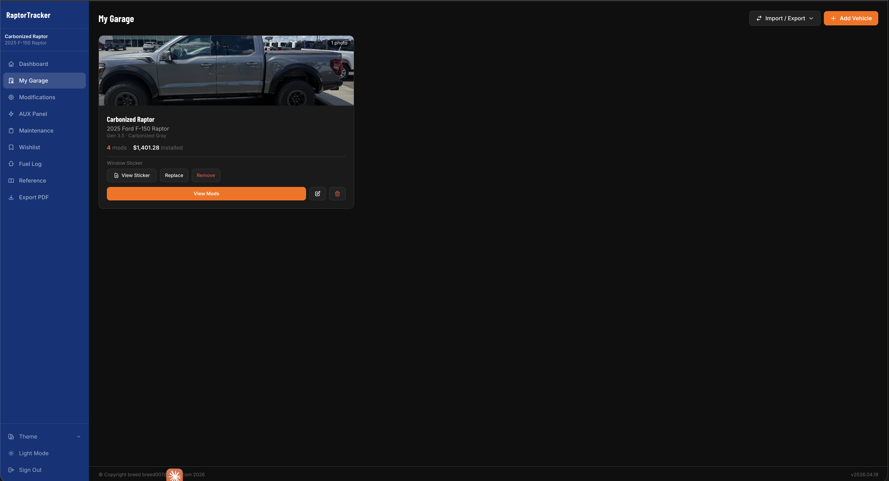
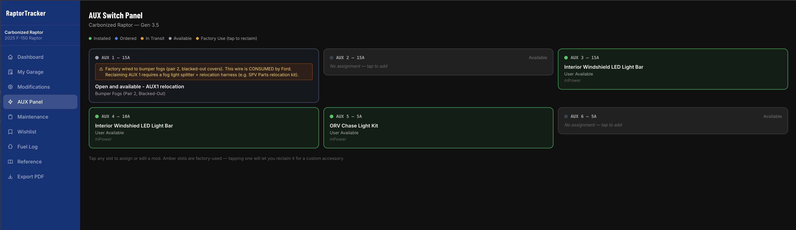

# RaptorTracker

**Ford Raptor Build Tracker** — a self-hosted web app for tracking modifications, maintenance, AUX switch assignments, warranties, fuel economy, and build costs across one or more Ford Raptors.

> Version `0.6.0` · [GitHub](https://github.com/breed007/RaptorTracker) · [Changelog](CHANGELOG.md)

---

## Screenshots

<p align="center">
  
</p>

<p align="center">
  
</p>

<p align="center">
  
</p>

---

## Features

### Modification Tracker
- Log each mod with part name, brand, part number, vendor, cost, purchase/install date, and install mileage
- Status tracking: Ordered → In Transit → Installed → Removed
- Photos per mod with a full-screen lightbox viewer
- Install notes and wiring notes shown in monospace
- Slide-out detail panel on the mod list — click any row for a quick view without leaving the page
- Assign a mod to one or more AUX switches, each with its own label

### AUX Switch Panel
- Factory-accurate AUX switch layouts for Gen 2, Gen 3, and Gen 3.5
- Shows which switches are factory-consumed versus available
- Assign mods to switches with custom per-switch labels
- Gen 3.5 marks AUX 1 as factory-consumed by the bumper fogs; assign a mod to it directly, or mark it available to use like any other switch (reversible per vehicle)

### Maintenance Log & Service Intervals
- Record service events with type, date, mileage, vendor, cost, and notes
- Tag who did the work: dealership, independent shop, or owner/DIY
- Attach invoices and receipts (JPEG, PNG, PDF) per record
- 20+ service-type presets (oil change, spark plugs, differential service, transmission, tires, battery, and more)
- Set mileage- or time-based intervals for recurring services (oil every 5,000 mi, diff fluid every 30,000 mi, and so on)
- The dashboard shows a Due Soon / Overdue card for anything approaching or past its interval, measured against the most recent service of that type

### Warranty Tracking
- Track extended and vehicle warranties: provider, term in years and miles, start and expiration dates, contract number, claims phone, cost, and deductible
- Expiration auto-calculates from the start date plus term when you leave it blank
- Per-mod warranty tracking for installed mods
- Color-coded status: active, expiring within 90 days, or expired
- The dashboard flags anything expired or expiring soon

### Fuel Log & MPG
- Log each fill-up: date, odometer, gallons, price per gallon, and station
- Calculates MPG per fill-up and plots the trend over time
- Compares your average against the factory EPA rating for your generation

### Wishlist
- A separate list for planned purchases, with priority, target budget, vendor links, and notes
- One button promotes a wishlist item into the active mod tracker once you buy it
- Compares planned spend against actual spend

### My Garage
- Multiple vehicles per account, each with its own isolated data
- Vehicle profile photo and window-sticker upload

### Total Cost of Ownership
- Unifies acquisition/financing, modifications, maintenance, and fuel into one view
- Cost-per-mile and operating-cost-per-mile, plus a cumulative-spend chart
- Financing section for owned-outright, loan, or lease — with paid-to-date, remaining balance, and interest

### Reminders (Email + Webhook)
- Optional daily digest of overdue/due-soon services, expired/expiring warranties, and registration/inspection/insurance deadlines
- Delivered by **email** (SMTP) and/or a **Discord/Slack webhook** — pick either or both
- Toggle service, warranty, and compliance alerts independently; configurable look-ahead window
- De-duplicated so you're not re-notified about the same item daily; off by default

### Logbook & Analytics
- **Logbook** — a single chronological history of the truck (mods, services, fuel, tires, warranties), filterable by type
- **Analytics** — mileage-over-time, miles per month, and maintenance cost by provider, plus a manual odometer log

### Backup & Restore
- One-click full backup (database + all uploads) to a single ZIP, and restore from a backup file
- Optional nightly automatic backups with configurable retention

### Install on Your Phone
- Installable progressive web app — add it to your home screen for a standalone app window
- **Quick Add** screen for logging a fill-up, odometer reading, or service in a few taps

### Find Anything
- Grouped sidebar navigation plus a `⌘K` command palette that searches mods, service, wishlist, tires, warranties, and fuel stops

### Registration, Inspection & Insurance
- Track registration, inspection/emissions, and insurance expiration per vehicle, with provider and policy details
- Deadlines feed the email reminders and are highlighted on the garage card when expiring

### Recall Lookup
- Dashboard surfaces open NHTSA recalls for your truck, matched by model and year; dismiss individually, collapse the card, and restore later

### Tire & Wheel Sets
- Track multiple sets (street vs. off-road) with specs, cost, install/removal mileage, and miles-run per set
- Tire spend rolls into Total Cost of Ownership

### Dashboard
- Installed mods, mod spend, in-transit, and on-order counts
- Maintenance spend total and last-service summary
- Spend-by-category chart
- Recent mods and recent maintenance
- Service-interval and warranty alerts

### Reference Library
Read-only factory specs for the full Ford Raptor lineup:
- **Gen 1** — 2010–2014 (6.2L V8 / 5.4L V8 SVT)
- **Gen 2** — 2017–2020 (3.5L EcoBoost)
- **Gen 3** — 2021–2023 (3.5L EcoBoost High Output)
- **Gen 3.5** — 2024–present (3.5L EcoBoost HO / Raptor R 5.2L Supercharged V8)

Engine, transmission, suspension, towing, payload, and AUX panel specs per generation.

### Exports
- PDF build sheet with vehicle info, installed mods, maintenance history, and spend breakdown (optionally with the window sticker)
- CSV export of any record type — mods, maintenance, fuel, warranties, tire sets, wishlist

### Vehicle Import / Export
- Export a vehicle to a ZIP archive (metadata, photos, window sticker, mods, maintenance)
- Import a ZIP onto the same or a different install — useful for backups or moving between servers

### Theme System
Three built-in themes, saved per browser:

| Theme | Style |
|---|---|
| **Ford Racing** (default) | Ford navy / orange, Inter + Barlow Condensed |
| **FordRaptorForum** | Dark XenForo style, crimson accent, Verdana |
| **Raptor Assault** | Light/dark, red accent, Roboto |

Each theme has a light/dark toggle, except FordRaptorForum, which is always dark.

---

## Prerequisites

| Requirement | Version | Notes |
|---|---|---|
| **Node.js** | 20.19+ or 22.12+ | 22 LTS recommended. Vite 5 needs at least 20.19 or 22.12. |
| **npm** | 10+ | Bundled with Node 22. |
| **git** | any recent | For cloning and pulling updates. |
| **Build tools** | — | Only if your platform has no prebuilt `better-sqlite3` binary. On Debian/Ubuntu: `apt install build-essential python3`. |

Everything else is a project dependency installed by `npm install`. Key ones:

| Layer | Package | Version |
|---|---|---|
| Backend | Express | 4.x |
| Database | better-sqlite3 (SQLite) | 9.x |
| Auth | express-session + bcrypt | — |
| File uploads | Multer | 2.x |
| PDF generation | PDFKit | 0.15.x |
| Import/Export | archiver + adm-zip | — |
| Frontend | React | 18.x |
| Build tool | Vite | 5.x |
| Routing | react-router-dom | 6.x |
| Charts | Chart.js + react-chartjs-2 | 4.x / 5.x |
| Styling | Tailwind CSS | 3.x |

---

## Quick Start (Local)

```bash
# 1. Clone
git clone https://github.com/breed007/RaptorTracker.git
cd RaptorTracker

# 2. Install dependencies (server, then client)
npm install
npm install --prefix client

# 3. Configure
cp .env.example .env        # then edit the values

# 4. Seed the database
npm run db:init

# 5. Run with hot reload (API + Vite dev server)
npm run dev
```

The API runs on `http://localhost:3000` and the Vite dev server on `http://localhost:5173`.

To run a production build locally instead of the dev server:

```bash
npm run build      # builds the client into dist/
npm start          # serves the API and the built client on PORT
```

> If `npm install --prefix client` ever reports a peer-dependency conflict (for example after a major Vite bump), re-run it with `npm install --prefix client --legacy-peer-deps`.

### Environment variables (`.env`)

```
PORT=3000
SESSION_SECRET=your-random-secret-here
ADMIN_USERNAME=admin
ADMIN_PASSWORD=yourpassword
DATA_DIR=./data
UPLOAD_DIR=./data/uploads
NODE_ENV=development

# Optional — email reminders (leave SMTP_HOST blank to disable)
SMTP_HOST=
SMTP_PORT=587
SMTP_SECURE=false
SMTP_USER=
SMTP_PASS=
SMTP_FROM=
```

---

## Installation (Linux Server)

The included `install.sh` sets up Node.js, PM2, an nginx or Apache reverse proxy, systemd startup, the firewall, and the seeded database.

```bash
git clone https://github.com/breed007/RaptorTracker.git
cd RaptorTracker
sudo bash install.sh
```

The script prompts for:
- Install directory (default `/opt/raptortracker`)
- Application port (default `3000`)
- Service account name (default `raptortracker`)
- Domain or IP
- Admin username and password
- Web server (nginx recommended, Apache supported, or standalone)
- Firewall configuration

It prints the URL, admin credentials, and PM2 commands when it finishes.

### Updating an existing server

If the install directory is a git clone:

```bash
cd /opt/raptortracker
git pull origin main
npm install            # only needed when a release adds dependencies
npm run build
pm2 restart raptortracker
```

### PM2 operations

```bash
pm2 list
pm2 logs raptortracker
pm2 restart raptortracker
pm2 stop raptortracker
```

(Prefix with `sudo -u raptortracker` if the app runs under a dedicated service account.)

---

## Project Structure

```
RaptorTracker/
├── server.js                  # Express entry point
├── server/
│   ├── db/
│   │   ├── index.js           # DB connection + migrations
│   │   └── init.js            # Schema creation + vehicle seed data
│   └── routes/
│       ├── mods.js
│       ├── maintenance.js
│       ├── intervals.js
│       ├── userVehicles.js
│       ├── vehicles.js
│       ├── warranty.js
│       ├── wishlist.js
│       ├── fuel.js
│       ├── export.js          # PDF build sheet
│       ├── vehicleTransfer.js # ZIP import/export
│       ├── upload.js
│       ├── summary.js
│       └── vin.js
├── client/
│   ├── src/
│   │   ├── pages/             # Dashboard, ModList, ModDetail, Maintenance, AuxPanel, Garage, Warranty, Wishlist, FuelLog, …
│   │   ├── components/        # Nav, Layout, StatsCard, SpendChart, Lightbox, …
│   │   └── context/
│   │       └── AppContext.jsx # Auth, vehicle selection, theme
│   ├── vite.config.js
│   └── tailwind.config.js
├── install.sh                 # Linux server installer
├── uninstall.sh
├── CHANGELOG.md
└── package.json
```

---

## Versioning

RaptorTracker follows [Semantic Versioning](https://semver.org) (`MAJOR.MINOR.PATCH`). The running version and build date show in the footer of every page. See [CHANGELOG.md](CHANGELOG.md) for release history.

To cut a release, update `"version"` in `package.json`, update the changelog, then rebuild:

```bash
npm run build
```

---

## Uninstall

```bash
sudo bash /opt/raptortracker/uninstall.sh
```

---

## License

Personal / private use. All rights reserved.

© Copyright breed breed007@gmail.com 2026
