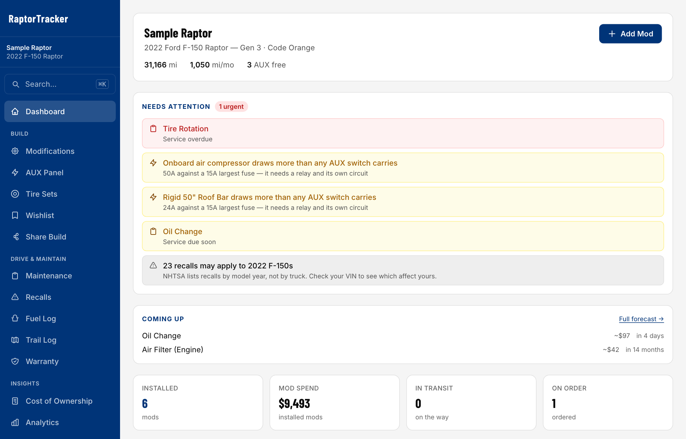
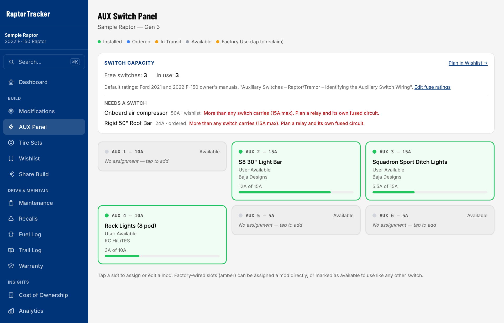
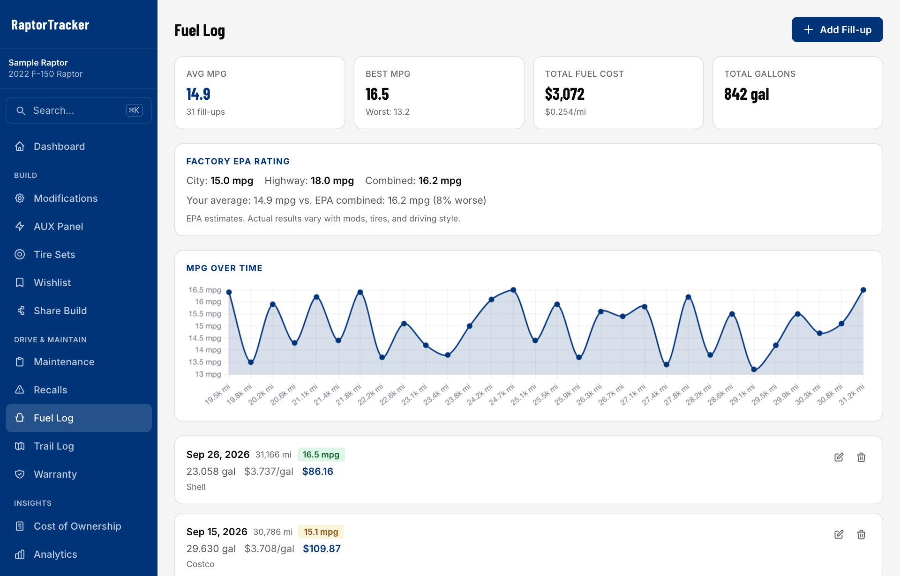

# RaptorTracker

A self-hosted build tracker for Ford Raptors: mods, AUX switch capacity, maintenance and what's
due next, fuel economy, warranties, and the cost of the whole thing. It runs on your own server or
a Raspberry Pi, and your records stay there.

> Version `1.0.0` · [User guide](docs/user-guide.md) · [Changelog](CHANGELOG.md) ·
> [Security](SECURITY.md) · [Contributing](CONTRIBUTING.md)

<p align="center">
  
</p>

<p align="center">
  
  
</p>

---

## What it does

**For the build**
- Track every mod: status from researching to installed, cost, photos, receipts, part numbers,
  install notes, and wiring notes.
- Plan the electrical side. The AUX panel knows the factory upfitter switch layout and fuse ratings
  for each generation (F-150 Raptor Gen 1 through Gen 3.5, Bronco Raptor, Ranger Raptor), shows
  the draw on each switch, and flags anything, installed or still on the wishlist, that would
  overload a circuit. Fuse ratings can be edited when your truck differs.
- Keep a wishlist with a monthly budget, and promote items to mods when you buy them.
- Share the build as BBCode for forums, Markdown, or plain text, with prices off unless you turn
  them on.

**For keeping it running**
- Service records with receipts, intervals (Ford's factory schedule or your own), and a forecast
  that turns "due in 3,400 miles" into a date based on how much you drive.
- A fuel log that measures economy full tank to full tank, handles partial and missed fill-ups, and
  compares you with the EPA rating.
- NHTSA recalls for your model year, triaged by you: affects my truck, doesn't apply, or repaired.
- Warranties, registration, inspection, and insurance with expiry reminders by email or a Discord
  or Slack webhook.
- Tire and wheel sets, and a trail log whose pressures build an air-down card for each set.
- Fluid capacities, part numbers, and wheel torque for your generation, copied from Ford's owner's
  manuals with the manual cited.

**For the money and the paperwork**
- Total cost of ownership, including the loan or lease, with cost per mile.
- A document vault for registration, insurance, and the window sticker.
- PDFs: a build sheet, and a vehicle history for selling the truck that shows buyers every service
  and its odometer reading.
- CSV export of everything, and CSV import that recognizes Fuelly, Drivvo, and Simply Auto exports.

**Around the edges**
- Miles or kilometers, gallons or liters, mpg or L/100 km, psi, kPa, or bar, and your currency.
- Installs on a phone's home screen, with a Quick Add screen for logging at the pump.
- Deletes go to a trash for 30 days, with an Undo right after.
- Nightly backups, copied off the box to a NAS, WebDAV, or S3-compatible storage.
- A sample truck on first run, so you can look around before typing anything in.
- Keyboard and screen-reader friendly, and readable in all three themes (light and dark).

The [user guide](docs/user-guide.md) walks through each of these.

---

## Installing

You need a 64-bit machine: a Linux server or VM, a Raspberry Pi 3 or newer, or anything that runs
Docker. Pick one of these.

### Docker (recommended)

The image is published for amd64 and arm64.

```bash
mkdir raptortracker && cd raptortracker
curl -fsSLO https://raw.githubusercontent.com/breed007/RaptorTracker/main/docker-compose.yml
curl -fsSL https://raw.githubusercontent.com/breed007/RaptorTracker/main/.env.example -o .env
# Edit .env: set SESSION_SECRET and ADMIN_PASSWORD (the file explains how to generate them)
docker compose up -d
```

Open `http://<server>:3000`. Data lives in the `raptortracker_data` volume. More detail, including
running behind a reverse proxy, is in [Docker Deployment](docs/deployment-docker.md).

### Linux server installer

`install.sh` sets up Node.js, PM2, an nginx or Apache reverse proxy, startup at boot, the
firewall, and the database. It supports Ubuntu, Debian (including Raspberry Pi OS), and the RHEL
family.

```bash
git clone https://github.com/breed007/RaptorTracker.git
cd RaptorTracker
sudo bash install.sh
```

It asks for the install directory, port, domain, admin password, and web server, and prints the
URL when it's done. See [Linux Deployment](docs/deployment-linux.md) for the details.

### From source

For development, or to run it by hand. Needs Node.js 22.12 or newer (24 recommended).

```bash
git clone https://github.com/breed007/RaptorTracker.git
cd RaptorTracker
npm install
npm install --prefix client
cp .env.example .env          # set SESSION_SECRET and ADMIN_PASSWORD
npm run db:init
npm run build && npm start    # or `npm run dev` for hot reload on :5173
```

After installing, sign in with the `.env` credentials and set a real password under
**Settings → Account**.

---

## Running on a Raspberry Pi

RaptorTracker runs on a Raspberry Pi 3, 4, 5, or Zero 2 W with Raspberry Pi OS (64-bit).
The Pi 1, Pi 2, and original Pi Zero can't run a 64-bit OS and aren't supported, and neither is
the 32-bit edition of Raspberry Pi OS on any model. The installer checks for this and stops with
an explanation.

### What it needs

These figures come from the arm64 Docker image with memory capped and the app limited to one CPU
core, on a truck with 400 fill-ups, 200 service records, and 40 photos:

| | Memory |
|---|---|
| Idle | about 40 MB |
| Busiest moment (backup, restore, PDF with photos, 3,000-row CSV import) | about 130 MB |
| Building the web app from source (`install.sh` or a git update) | about 450 MB |

The running app fits in 300 MB with room to spare, so a 512 MB Zero 2 W or Pi 3 A+ can run it.
Building it from source can't fit in what a 512 MB board has free, so on those boards either use
the Docker image, which is already built, or let `install.sh` add a temporary 1 GB swap file for the
build (it does this on its own when memory is short and removes the file afterwards).

Speed was measured on a much faster core than a Pi's. On a Pi 4, expect most pages to load in well
under a second, and a backup of a few gigabytes of photos to take a few minutes.

### Recommendations

- A Pi 4 with 2 GB or more, or any Pi 5, is comfortable. A Pi 3 or Zero 2 W works for one or two
  trucks.
- SD cards wear out, and a dying card takes the database with it. Boot from a USB SSD if you can
  (the Pi 4 and 5 support it), or use a high-endurance card, and set up off-box copies under
  Settings → Backups so the backups don't live on the same card.
- Use the official power supply. Undervoltage is a common cause of SD card corruption.
- Photos are resized in the browser before they upload, so a phone photo takes under 1 MB instead
  of several. Photos uploaded before 1.0 can be shrunk under Settings → Backups → Storage.

### Installing on a Pi

1. Write Raspberry Pi OS Lite (64-bit) to the card or SSD with
   [Raspberry Pi Imager](https://www.raspberrypi.com/software/), turning on SSH in its settings.
2. Then either install Docker with [Docker's instructions for Debian](https://docs.docker.com/engine/install/debian/)
   and follow [Docker](#docker-recommended) above (the same commands pull the ARM64 image), or use
   the [Linux server installer](#linux-server-installer).

Set `TZ` (Docker) or the Pi's timezone (`sudo raspi-config`) so reminders and nightly backups run
at the hour you expect.

---

## Upgrades and the 1.0 promise

1.0 is a promise about your data:

- **Every upgrade keeps your records.** A database from any earlier release, 0.x included, is
  migrated forward automatically the first time the new version starts. CI rebuilds the database
  of every released version and migrates it to the current code on every change.
- **Within 1.x nothing you rely on breaks:** not the database, backups, vehicle exports, `.env`
  settings, or the install methods. A backup or vehicle export from any 1.x release restores into
  any later 1.x release. If something has to change, it's announced in the changelog a release
  ahead, and the old way keeps working until 2.0.
- **Upgrading is one step back from undoable.** Take a backup first (**Settings → Backups → Back
  Up Now**). Going back to an older version isn't supported; restoring that backup into the older
  version is how you would.

The app tells you when a new version is out (**Settings → General**), with the command for how it
was installed:

```bash
# Docker
docker compose pull && docker compose up -d

# install.sh: in the folder you cloned and installed from
git pull && sudo bash install.sh --update

# from source
git pull && npm ci --omit=dev && npm ci --prefix client && npm run build   # then restart
```

`install.sh --update` copies the database to `data/backups/` first, then installs the new
version's dependencies, rebuilds, and restarts the app, without asking the install questions
again.

---

## Security

RaptorTracker is a single-owner app with one password, so a few things matter if you put it
anywhere the internet can reach:

- **Change the password in the app.** `ADMIN_PASSWORD` in `.env` only bootstraps the first
  sign-in. Set a real one under **Settings → Account** and it's stored as a bcrypt hash in the
  database; the `.env` value is then ignored. The app warns on every start until you do.
- **Sign-in attempts are rate limited** to 10 failures per 15 minutes per address. Successful
  sign-ins don't count against the limit.
- **Set `TRUST_PROXY`** to the number of reverse proxies in front of the app (`install.sh` writes
  `1`). Without it, the rate limiter sees the proxy's address instead of the real visitor, and one
  attacker can lock you out.
- **Serve it over HTTPS** and set `COOKIE_SECURE=true` so the session cookie isn't sent in the
  clear.

There is no password reset by email; the [troubleshooting guide](docs/user-guide.md#troubleshooting)
explains how to reset it on the server. To report a vulnerability, see [SECURITY.md](SECURITY.md).

### What leaves your server

Your data stays in one SQLite file on your server. RaptorTracker makes these outside requests, and
none of them carry your records:

| Request | When | What's sent |
|---|---|---|
| GitHub releases API | Once a day, to see whether a newer version is out | The RaptorTracker version, in the User-Agent |
| NHTSA vPIC | When you decode a VIN | The VIN |
| NHTSA recalls API | When you open Recalls or the dashboard | Make, model, and year |
| Reminder email or webhook | When reminders are on and something is due | The reminder text, to the server and address you configured |
| Off-box backup copy | After each backup, if you set a destination | The backup file, to the folder, WebDAV server, or bucket you chose |

The release check can be turned off under **Settings → General**, or for the whole install with
`UPDATE_CHECK=false`. Separately, your browser loads fonts from Google Fonts when it opens the app.

---

## Configuration

Settings that belong to the server live in `.env` (or the Compose `.env`). Everything else is set
in the app under **Settings**.

| Variable | Default | What it does |
|---|---|---|
| `SESSION_SECRET` | none | Signs session cookies. Required in production; 32 or more random characters. |
| `ADMIN_USERNAME` | `admin` | The sign-in name. |
| `ADMIN_PASSWORD` | none | The first sign-in's password, until you set one in the app. |
| `PORT` | `3000` | Port the server listens on. |
| `DATA_DIR` | `./data` | Where the database and backups live. |
| `UPLOAD_DIR` | `./data/uploads` | Where photos and documents live. |
| `NODE_ENV` | `development` | Set `production` on a server (the Docker image does). |
| `TRUST_PROXY` | none | Number of reverse proxies in front of the app. |
| `COOKIE_SECURE` | `false` | `true` when the app is served over HTTPS. |
| `TZ` | server time | Timezone, mainly for Docker. |
| `REMINDER_HOUR` | `8` | Hour of the daily reminder check. |
| `REMINDER_TZ` | server time | Timezone for that hour, e.g. `America/Denver`. |
| `UPDATE_CHECK` | on | `false` turns off the daily release check for the whole install. |
| `SMTP_HOST`, `SMTP_PORT`, `SMTP_SECURE`, `SMTP_USER`, `SMTP_PASS`, `SMTP_FROM` | none | Email for reminders. Leave `SMTP_HOST` blank to skip email. |

---

## Development

```
server.js                 Express entry point
server/
  db/                     connection, migrations (run on every start), first-run seed
  reference/              Ford reference data: vehicles, AUX layouts, fluids (synced on start)
  routes/                 HTTP routes, kept thin
  services/               the logic: units, trash, backups, reports, imports, odometer, …
client/src/
  pages/                  one file per screen; settings/ for the Settings tabs
  components/             shared pieces: Dialog, Nav, charts, forms
  lib/                    units, toasts, photo resizing, dialog behavior
test/                     smoke, API, upgrade, and security suites
e2e/                      Playwright browser tests
docs/                     user guide, deployment guides, landing page
```

```bash
npm test                 # schema, migrations, reference data, accessibility checks on the JSX
npm run test:api         # the app's routes over HTTP
npm run test:upgrade     # every released version's database migrated to this one
npm run test:security    # path traversal, hostile archives, unauthenticated access
npm run test:e2e         # the built app in Chromium, with an accessibility scan
```

The tests use throwaway data and never touch `data/`. [CONTRIBUTING.md](CONTRIBUTING.md) covers
setup and conventions.

| Layer | Package |
|---|---|
| Server | Express 4, better-sqlite3 13, express-session, bcrypt, Multer 2, PDFKit, archiver, yauzl |
| Client | React 18, React Router 7, Vite 8, Tailwind CSS 3, Chart.js 4 |

---

## Versioning

RaptorTracker follows [Semantic Versioning](https://semver.org). The running version and build
date are in the footer of every page, and [CHANGELOG.md](CHANGELOG.md) has the history.

## Uninstall

```bash
sudo bash /opt/raptortracker/uninstall.sh
```

With Docker, `docker compose down` stops it; add `-v` to delete the data volume too.

## License

[MIT](LICENSE). Fork it, change it, run it however you want.

© 2026 [breed007](https://github.com/breed007)
